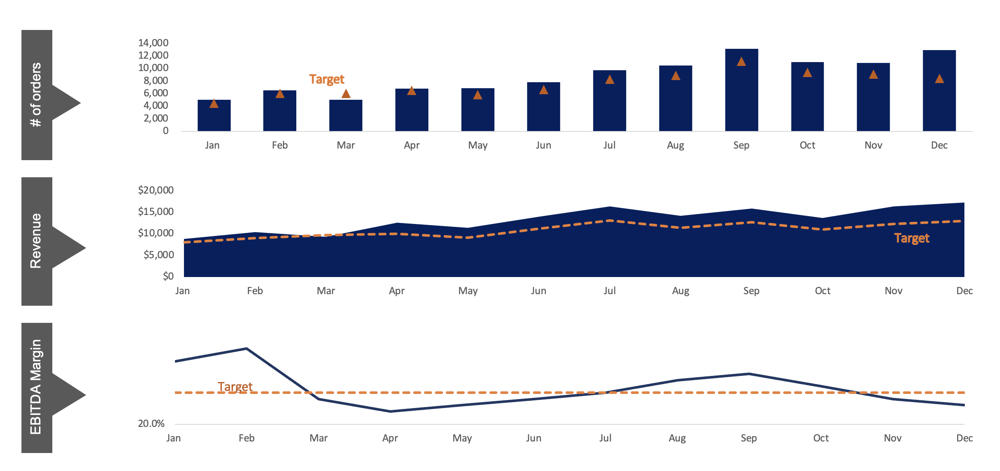
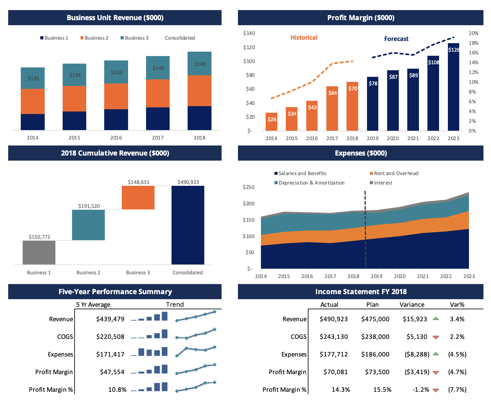
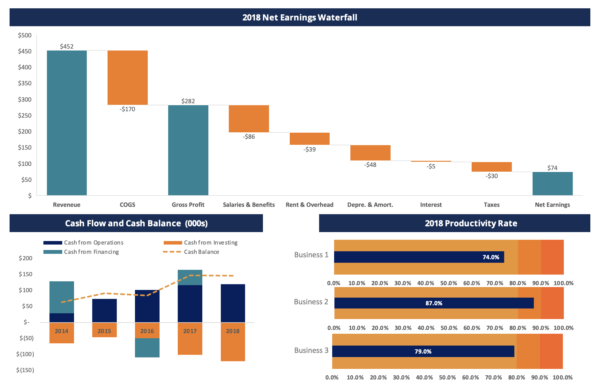

# 📊 Converting Financial Data into Visual Insights
### Excel Dashboards | KPI Reporting | Financial Storytelling | Data Visualization

---

## 📌 Project Overview

This project was completed as part of the **Financial Modeling & Valuation Analyst (FMVA)** certification by the **Corporate Finance Institute (CFI)**.

It focuses on one of the most critical skills in financial analysis — translating raw financial data into clean, decision-ready visual dashboards. Three progressively complex dashboards were built, each targeting a different area of financial performance reporting.

> **Note:** These dashboards were built following CFI-guided templates. All chart construction, data linking, formatting, and visual design decisions were applied hands-on.

---

## 📊 Dashboard 1 — KPI Growth Dashboard

**Focus:** Monthly operational and financial performance vs targets

### What It Tracks
| KPI | Description |
|-----|-------------|
| **# of Orders** | Monthly order volume vs target |
| **Revenue** | Monthly revenue ($000s) vs target |
| **EBITDA Margin** | Monthly margin % vs 25% target |
| **Website Traffic** | Page views performance indicator |
| **Conversion Rate** | Visitor-to-customer conversion tracking |
| **New Customers** | Acquisition performance vs benchmark |

### Dashboard 1 — KPI Growth Dashboard

### Key Skills Demonstrated
- Actual vs Target variance visualization
- Bullet chart / gauge-style KPI indicators
- Monthly trend charting with dynamic data ranges
- Performance threshold color coding (Weak / OK / Strong)

---

## 📊 Dashboard 2 — Business Unit Revenue & Financial Performance

**Focus:** Multi-business consolidated P&L, forecasting, and balance sheet summary (2014–2023)

### What It Covers
| Section | Detail |
|---------|--------|
| **Business Unit Revenue** | Revenue by Business 1, 2, 3 + consolidated (historical & forecast) |
| **Profit Margin Trends** | Margin % tracking across 5-year historical + forecast period |
| **Expense Breakdown** | Salaries, Rent, D&A, Interest — trend and composition |
| **P&L Summary 2018** | Revenue, COGS, expenses, and net operating profit |
| **Balance Sheet Summary** | Current/non-current assets, liabilities, shareholders' equity |
| **5-Year Performance Summary** | Average, actual vs plan, variance analysis |

### Dashboard 2 — Business Unit Revenue & Financial Performance

### Key Skills Demonstrated
- Multi-series revenue trend charts
- Waterfall-style variance analysis
- Actual vs Plan comparison tables
- Consolidated financial statement visualization
- Forecast period extension modeling

---

## 📊 Dashboard 3 — Cash Flow, Waterfall & Productivity Analysis

**Focus:** Cash flow trends, net earnings decomposition, and business unit productivity (2014–2018)

### What It Covers
| Section | Detail |
|---------|--------|
| **Cash Flow Analysis** | Operating, investing, and financing cash flows + net change |
| **Cash Balance Trend** | Cumulative cash balance 2014–2018 |
| **Net Earnings Waterfall** | Revenue → COGS → Gross Profit → Expenses → Net Earnings breakdown |
| **Productivity Rate** | Business unit level performance vs benchmarks (Bus 1, 2, 3) |

### Key 2018 Waterfall Figures
| Item | Amount ($000s) |
|------|---------------|
| Revenue | $452,316 |
| COGS | ($170,130) |
| Gross Profit | $282,186 |
| Total Expenses | ($207,705) |
| **Net Earnings** | **$74,181** |

### Dashboard 3 — Cash Flow, Waterfall & Productivity

### Key Skills Demonstrated
- Waterfall chart construction in Excel
- Cash flow trend visualization
- Multi-period cash balance charting
- Productivity gauge/donut chart design
- Stacked bar and combo chart techniques

---

## 🧠 Skills Demonstrated Across All Dashboards
`Excel Charts & Graphs` `Pivot Tables` `KPI Dashboard Design` `Actual vs Target Analysis` `Waterfall Charts` `Financial Storytelling` `Data Visualization` `P&L Reporting` `Cash Flow Analysis` `Variance Analysis`

---

*Completed as part of the FMVA Certification — Corporate Finance Institute (CFI)*
